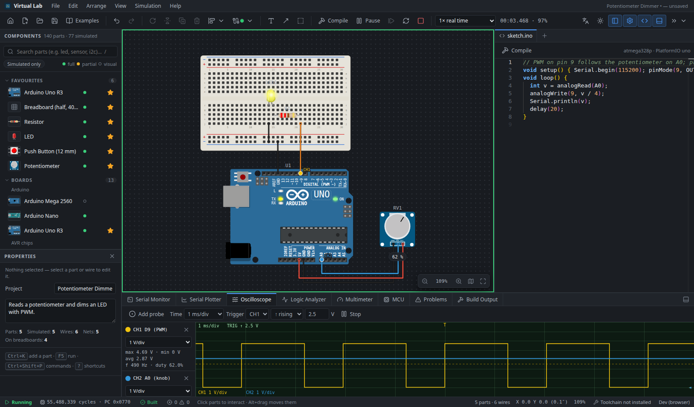
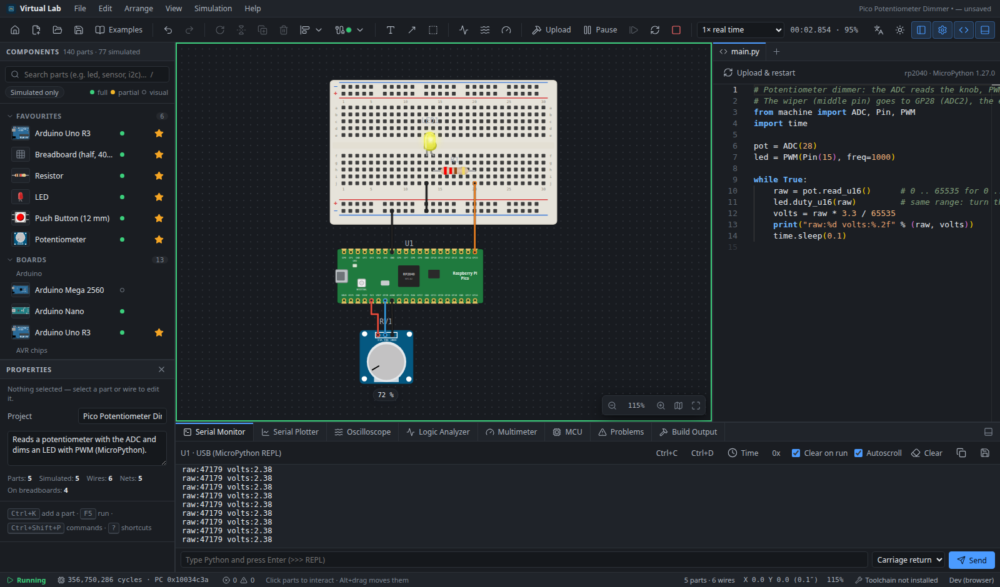
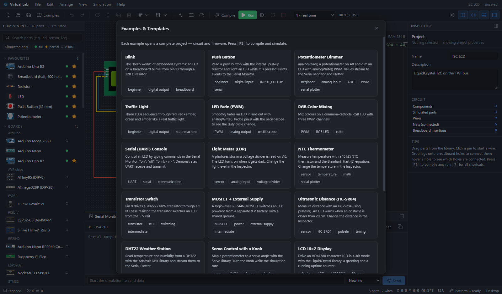
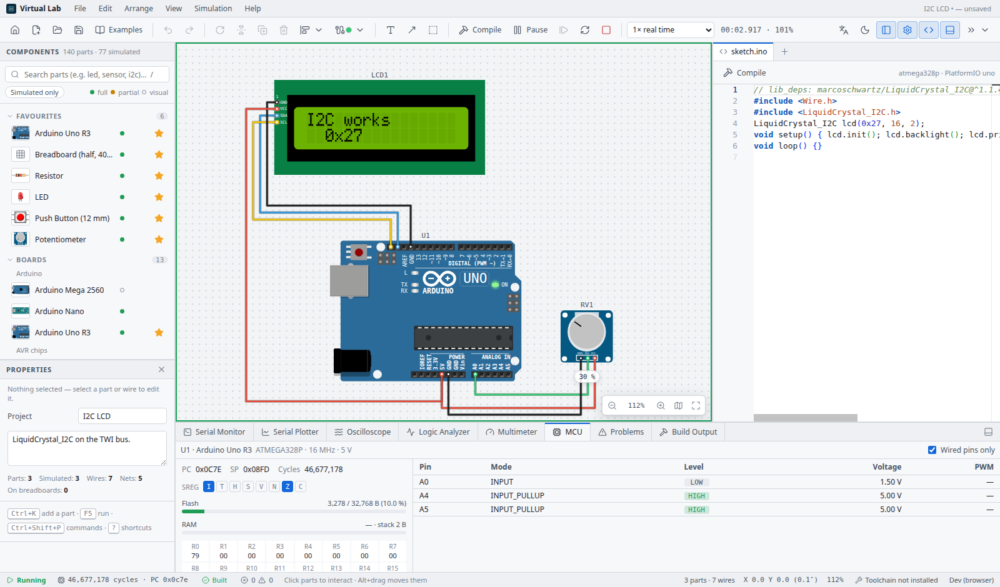
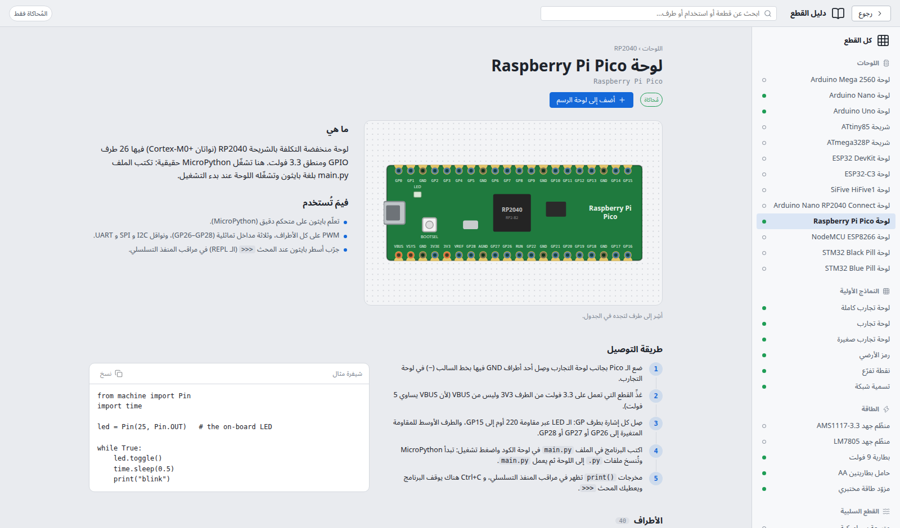
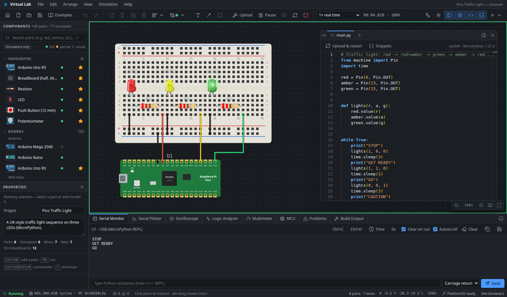
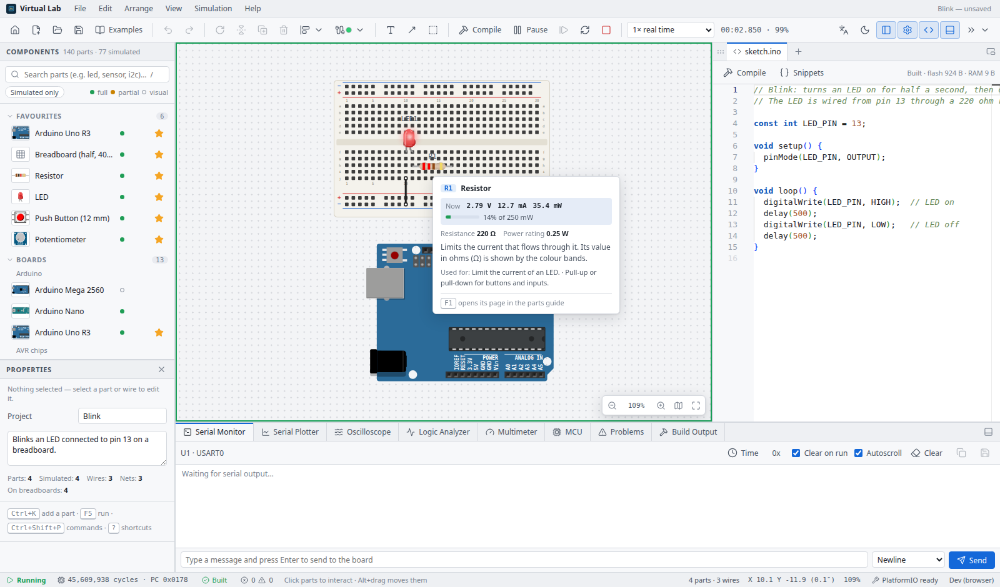

# Embedded Systems Virtual Lab

An offline, native desktop laboratory for designing, wiring, programming, simulating and
debugging embedded systems. Drag an Arduino, a breadboard, a resistor and an LED onto the
canvas, wire them, write Blink, press **Run** — the sketch is compiled with the real AVR GCC
toolchain and executed on a cycle-accurate ATmega328P emulator that drives the simulated
circuit. Prefer Python? Put a **Raspberry Pi Pico** on the canvas: the real MicroPython
firmware runs on an emulated RP2040, with an interactive `>>>` prompt in the Serial Monitor.

The interface is available in **English and Arabic** (right-to-left).

Built with Tauri 2, React, TypeScript, avr8js, rp2040js, MicroPython, Wokwi Elements, Monaco
Editor and PlatformIO.

**[⬇ Download the Windows installer](../../releases/latest)**



| Python on a Raspberry Pi Pico — ADC and PWM, values in the REPL | 27 ready-to-run examples on the start screen |
|---|---|
|  |  |

| Light theme — an I²C LCD on the emulated TWI bus, MCU panel open | Arabic interface — the Parts Guide |
|---|---|
|  |  |

| The code editor floats anywhere — a Pico traffic light running in MicroPython | Live readings — a resistor's voltage, current and power while Blink runs |
|---|---|
|  |  |

## Highlights

- **Start screen**: recent projects with live previews, new projects from templates (Uno, Nano,
  Pico, breadboards with powered rails, digital logic), the example gallery and a Learn tab;
  **New project** opens the editor straight away on the template used last.
- **Two languages**: English and Arabic, switchable at any time; Arabic mirrors the interface
  right-to-left while the canvas, code and numbers stay left-to-right.
- **Eight themes**: light, dark, midnight, Nord, Dracula, Solarized, blueprint and high
  contrast, each with a matching code-editor theme; a Settings dialog (Ctrl+,) explains every
  option.
- **Help where you look**: every button, setting and part explains itself on hover; the
  **Parts Guide** (F1) covers all 140 parts — what it is, what it is for, how to wire it step
  by step, every pin and the matching Arduino Uno and Raspberry Pi Pico pins, example code.
- **Learn while you work**: a short tour the first time; while simulating, a part's card shows
  the voltage across it, the current, the power and how much of its rating that is; Problems
  explain each issue in English or Arabic with how to fix it and a link to the part's guide
  page; the code editor explains Arduino functions in both languages.
- **Workspace**: infinite canvas — pan by dragging with the right (or middle) mouse button,
  minimap (`M`), edge scrolling while dragging, arrow keys, wheel or touchpad mode; drag-and-drop
  library, rotate/flip/duplicate, multi-select, align/distribute, undo/redo, copy/paste,
  context menus, grid snapping, orthogonal wires with editable bends, junctions, net labels,
  wire colours and labels, A* auto-routing; double-click a part to set its value (resistors show
  their colour bands); lock parts in place (Ctrl+L) so a breadboard cannot move by mistake.
- **Notes and search**: text notes, arrows and frames on the canvas (`T`, `A`, `B`); Find
  (Ctrl+F) jumps to a part, a net or a note.
- **Export**: the circuit as a PNG up to 768 DPI (8×) or an SVG, white, themed or transparent,
  whole circuit or selection; Copy as Image (Ctrl+Shift+C).
- **Fast to drive from the keyboard**: command palette (Ctrl+Shift+P), quick add a part
  (Ctrl+K or double-click the canvas), recent projects, `.evlab` file association and drag and
  drop, live build state in the status bar.
- **Breadboards that understand connectivity**: legs dropped on holes connect automatically;
  hover a hole to see every connected hole highlighted.
- **Component library**: 140 parts across 12 categories; 77 have simulation models (55 full,
  22 partial), including the Raspberry Pi Pico, NeoPixels, an SSD1306 OLED, MPU-6050, DS1307,
  IR remote/receiver, keypad, rotary encoder, DC and stepper motors with L298N/A4988 drivers.
  Every part shows whether it is *fully simulated*, *partially simulated* or *visual-only*.
- **Interactive simulation**: drag the obstacle in front of an ultrasonic sensor, tilt an IMU,
  move a joystick, turn an encoder, press keypad and IR-remote keys, set temperature/light/gas
  with on-canvas sliders; parts show live feedback (beams, waves, glows, readouts).
- **Real firmware (Arduino C++)**: Monaco editor with Arduino completions and hover docs,
  multi-file sketches, automatic library resolution, PlatformIO compilation, compiler errors as
  editor markers.
- **The code editor where you want it**: drag its tab bar to float it anywhere over the lab,
  resize it, and drag it back (or double-click its bar) to dock it; ready-made snippets for
  Arduino and MicroPython (debounce, `millis()` timers, a state machine, PWM fade, servo,
  interrupts, averaged ADC readings); export the code to the Arduino IDE or Thonny, import
  `.ino`, `.h`, `.cpp` and `.py` files.
- **Python (MicroPython on the Raspberry Pi Pico)**: no compiler needed — Run copies `main.py`
  and your modules to the board's file system and starts it; the Serial Monitor is the REPL
  (Ctrl+C / Ctrl+D); tracebacks appear in Problems and on their line in the editor;
  completions and hover help (English and Arabic) for `machine`, `time` and `neopixel`; GPIO,
  PWM, ADC, I2C (incl. `SoftI2C` and `I2C.scan()`), SPI and NeoPixels drive the circuit.
- **Simulation**: run, pause, step (1 ms / instruction), reset, stop, 0.01×–4× or max speed;
  live interaction with buttons, knobs, switches and sensors.
- **Instruments**: serial monitor (bidirectional, UTF-8, timestamps, hex view, save log), serial
  plotter, oscilloscope with trigger and measurements, 8-channel logic analyzer with UART
  decoding and VCD export, multimeter (V / Ω / A), signal generator.
- **Debugging**: MCU panel with pin modes, levels, voltages and PWM duty, PC/SP and the flags,
  R0–R31 (AVR) or R0–R12/LR (ARM) and flash/RAM use; voltage badges on wires (View › Show
  Voltages, `V`); Ctrl+B while running flashes the new build (or uploads the new Python files)
  into the board without stopping the rest of the circuit.
- **Electrical checks**: shorts, supply conflicts, unconnected required pins, floating inputs,
  undefined logic levels, pin/supply over-current, LED over-current and reverse bias.
- **Wokwi projects**: open a project from wokwi.com — its downloaded zip, or its `diagram.json`
  with the code, also by dropping them on the window — and save the open project for Wokwi
  (File › Wokwi). Parts, values, positions, wires and their colours, breadboard holes and the
  code carry over.
- **Projects**: versioned `.evlab` files with crash-recovery autosave; once saved, a project is
  saved again by itself a moment after each change; **Version History** keeps a copy at each
  run and save (the last 30) to look at and bring back; 27 example projects
  (Blink, button, PWM, traffic light, RGB, UART console, LDR, thermistor, transistor, MOSFET,
  HC-SR04, DHT22, servo, LCD, I²C LCD, SPI shift register, buzzer, relay, logic half adder,
  keypad lock, encoder + NeoPixel ring, MPU-6050 + OLED spirit level, and four MicroPython
  projects on the Pico), searchable by tag.
- **Sturdy**: if a part of the window fails, it shows what happened with *Back* and *Try again*
  instead of leaving the window empty; Help › Report a Problem copies the details. Interface
  size 80–150 % (Ctrl+Alt+= / −) for small screens and projectors; the serial monitor
  remembers what you sent (↑/↓).
- **Extensible**: components, behaviour models, MCU emulators and toolchains are registered,
  not hard-coded; JSON component packages load from the user's packages folder.

## Getting started (users)

1. Download `EmbeddedSystemsVirtualLab_0.4.0_x64-setup.exe` (or the `.msi`) from the
   [Releases page](../../releases/latest) and run it. Windows 10/11 x64; the installer is not
   code-signed yet, so SmartScreen may ask you to confirm ("More info" → "Run anyway").
2. The start screen opens: pick an example, a template or a recent project. Switch the
   language (EN | ع) and the theme from its top bar. The first time, a short tour shows the
   lab (Help › Take the Tour shows it again).
3. Python projects on the Raspberry Pi Pico run straight away. For Arduino projects, the first
   compile offers to install the firmware toolchain (PlatformIO, ~300 MB, needs Python 3.9+ and
   internet once); afterwards everything works offline.
4. Press **F5** to run. Rest the mouse on anything to learn what it does; **F1** opens the Parts
   Guide.

### Essential shortcuts

| Action | Keys |
|---|---|
| Pan the canvas | drag with the right mouse button (or Space + drag, middle button) |
| Zoom / fit | mouse wheel · `F` fit · `0` 100 % · `M` minimap |
| Add a part | Ctrl+K, or double-click the canvas |
| Rotate / flip / delete | `R` · `H` · Del |
| Set a part's value / lock it | double-click it · Ctrl+L |
| Text note / arrow / frame | `T` · `A` · `B` |
| Find on the canvas | Ctrl+F |
| Compile (Arduino) or upload (Python) | Ctrl+B |
| Run / pause / stop | F5 · F6 · Shift+F5 |
| Parts Guide | F1 |
| Export image / copy as image | Ctrl+Shift+E · Ctrl+Shift+C |
| Interface size | Ctrl+Alt+= · Ctrl+Alt+− · Ctrl+Alt+0 |
| Every command | Ctrl+Shift+P · `?` lists all shortcuts |

## Development

Prerequisites: Node 20+, Rust (MSVC toolchain + Windows 10/11 SDK), Python 3.9+.

```bash
npm install
```

Install a repository-local PlatformIO used by the dev server, tests and debug builds:

```bash
py -m venv .toolchain/penv
```

```bash
.toolchain/penv/Scripts/python -m pip install platformio
```

Run the UI in a browser (dev only — uses an HTTP shim for compilation):

```bash
npm run dev
```

Run the desktop app in development mode:

```bash
npm run app:dev
```

Build the installers (`src-tauri/target/release/bundle/{nsis,msi}`):

```bash
npm run app:build
```

Tests (unit, simulation, examples — including MicroPython running on the emulated Pico):

```bash
npm test
```

Compile and simulate every example end to end (slow):

```bash
EVLAB_E2E=1 npx vitest run tests/examples-run.test.ts
```

Rust backend tests (the ignored one compiles firmware with `.toolchain/`):

```bash
cargo test --manifest-path src-tauri/Cargo.toml -- --include-ignored
```

Floating-UI check (menus, popovers, dialogs stay inside the window, in both themes and in
Arabic), against the running dev server:

```bash
node tools/ui-floating-check.mjs
```

Sweep the interface for errors — every example run in English and Arabic across the themes
(instruments, language and theme switched while running, the floating editor), then the dialogs
and pages — against the running dev server:

```bash
node tools/ui-sweep.mjs
```

The built desktop application in its WebView2 (the Windows build runs both on every pull
request):

```bash
node tools/e2e-desktop.mjs --exe src-tauri/target/release/evlab.exe
```

The MicroPython firmware for the Pico is committed in `public/firmware/`. To rebuild it from
the official sources (Linux or WSL, Arm GNU toolchain):

```bash
tools/build-micropython.sh
```

Interface text: English strings are the keys; every new string needs its Arabic translation in
`src/i18n/ar.ts` (the type checker reports missing ones).

## Documentation

- [Technology research & licences](docs/01-technology-research.md)
- [Architecture](docs/02-architecture.md)
- [Component packages (extending the library)](docs/03-component-packages.md)
- [Simulation fidelity & limitations](docs/04-simulation-fidelity.md)
- [UI regression checklist (floating UI, layering)](docs/05-ui-regression-checklist.md)
- [Roadmap](docs/06-roadmap.md)
- Architecture decisions: [desktop shell](docs/adr/ADR-001-desktop-shell.md),
  [MCU emulation](docs/adr/ADR-002-mcu-emulation.md),
  [real-time solver](docs/adr/ADR-003-realtime-circuit-solver.md),
  [toolchain](docs/adr/ADR-004-firmware-toolchain.md)

## Repository layout

```
src/core/        Circuit model, component model, registry, netlist, ERC, project format,
                 simulation kernel (solver, engine, MCU emulators, behaviour models),
                 instruments (decoders), toolchain types        — no UI code
src/components/  Built-in component package (definitions, generated SVG visuals, breadboards,
                 the Parts Guide content in English and Arabic)
src/examples/    Example projects and new-project templates (built from real geometry)
src/i18n/        Interface languages: English keys, Arabic catalogue, right-to-left switch
src/state/       Stores: project + history, editor, simulation client (Web Worker)
src/ui/          Desktop UI: start screen, workspace canvas, library, inspector, Monaco editor
                 (Arduino and MicroPython help), instruments, Parts Guide, image export
src/platform/    Tauri / browser service adapters
public/firmware/ MicroPython for the simulated Raspberry Pi Pico (with its licence)
src-tauri/       Rust backend: PlatformIO toolchain, project and image IO, package discovery
tests/           Vitest suites driving real compiled firmware (fixtures/*.ino → *.hex) and
                 MicroPython on the emulated RP2040
tools/           Dev-only Vite toolchain shim, Wokwi geometry measurement, fixture builder,
                 MicroPython build script, floating-UI check, interface sweep, desktop test
```
